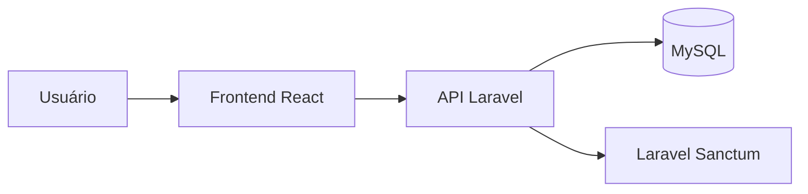
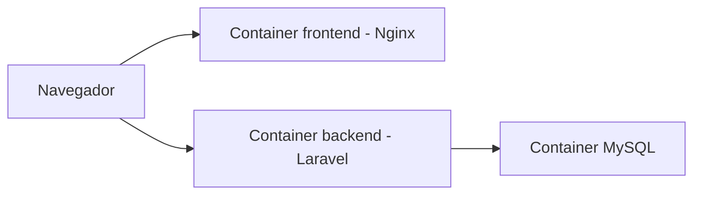
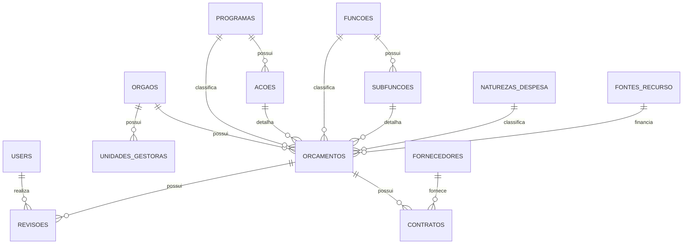

# Arquitetura do Projeto

Este documento descreve a arquitetura geral do sistema de acompanhamento da execução orçamentária desenvolvido por **Davi Tenório**.

O projeto foi construído como uma aplicação full stack em formato de monorepo, separando claramente backend, frontend, banco de dados e documentação.

---

## Visão geral

A aplicação é composta por três partes principais:

- Backend em Laravel, responsável pela API REST, regras de negócio, autenticação, acesso ao banco e exposição dos dados.
- Frontend em React + TypeScript, responsável pela interface do usuário e consumo da API.
- Banco de dados MySQL, responsável pela persistência dos dados de órgãos, orçamentos, contratos, revisões e entidades auxiliares.

A comunicação entre frontend e backend acontece via HTTP, utilizando JSON como formato de troca de dados.

---

## Fluxo da aplicação

O fluxo principal da aplicação é:

1. O usuário acessa o frontend.
2. O frontend realiza login na API Laravel.
3. A API valida as credenciais e retorna um Bearer Token.
4. O frontend armazena o token e utiliza esse token nas rotas protegidas.
5. O frontend consome endpoints de dashboard, orçamentos, contratos e gráficos.
6. O backend consulta o MySQL utilizando Eloquent ORM.
7. A API retorna os dados em JSON para exibição na interface.

Representação simplificada:



---

## Estrutura em monorepo

O projeto foi organizado em monorepo para facilitar a avaliação, execução e versionamento.

```
seplag/
├── backend/
├── frontend/
├── docs/
├── docker-compose.yml
└── README.md
```

### Backend

A pasta `backend` contém a API Laravel.

Principais responsabilidades:

- autenticação;
- regras de negócio;
- migrations;
- seeders;
- models Eloquent;
- controllers;
- rotas da API;
- documentação dos endpoints.

### Frontend

A pasta `frontend` contém a aplicação React + TypeScript.

Principais responsabilidades:

- tela de login;
- rotas protegidas;
- dashboard;
- gráficos;
- listagem de orçamentos;
- detalhe de orçamento;
- listagem de contratos;
- consumo da API.

### Docs

A pasta `docs` contém documentação complementar sobre arquitetura e decisões técnicas.

---

## Arquitetura com Docker

O projeto utiliza Docker Compose para subir todos os serviços necessários.

Serviços principais:

- `mysql`: banco de dados MySQL.
- `backend`: API Laravel.
- `frontend`: aplicação React buildada e servida por Nginx.

Fluxo entre containers:



O backend se conecta ao banco utilizando o host interno `mysql`, definido na rede do Docker Compose.

O frontend é servido na porta `5173`, enquanto a API Laravel fica disponível na porta `8000`.

---

## Backend

O backend foi desenvolvido com Laravel e estruturado como uma API REST.

Principais componentes:

- `routes/api.php`: definição das rotas da API.
- `app/Http/Controllers`: controllers responsáveis pelos endpoints.
- `app/Models`: models Eloquent.
- `database/migrations`: estrutura do banco.
- `database/seeders`: geração de massa fictícia.
- `database/factories`: suporte à geração de dados.

A API expõe endpoints para autenticação, dashboard, órgãos, orçamentos, contratos, gráficos e revisão de orçamento.

---

## Autenticação

A autenticação foi implementada com Laravel Sanctum utilizando Bearer Token.

Rotas públicas:

- `POST /api/auth/login`
- `GET /api/dashboard`
- `GET /api/orgaos`
- `GET /api/orcamentos`
- `GET /api/orcamentos/{id}`
- `GET /api/contratos`
- `GET /api/graficos`

Rotas protegidas:

- `GET /api/auth/me`
- `POST /api/auth/logout`
- `PATCH /api/orcamentos/{id}/revisao`

O token retornado no login é utilizado pelo frontend nas chamadas autenticadas.

---

## Frontend

O frontend foi desenvolvido com React, TypeScript e Vite.

A aplicação utiliza:

- Axios para comunicação HTTP com a API.
- React Router DOM para navegação.
- React Query para controle de requisições e cache.
- Recharts para gráficos.
- Bootstrap e CSS customizado para interface.

As principais páginas são:

- Login.
- Dashboard.
- Orçamentos.
- Detalhe de orçamento.
- Contratos.

---

## Entidade central

A entidade central do domínio é `Orcamento`.

Um orçamento representa uma autorização de gasto vinculada a órgão, unidade gestora, programa, ação, função, subfunção, natureza da despesa e fonte de recurso.

Além disso, um orçamento pode possuir contratos vinculados e revisões feitas por usuários autenticados.



---

## Banco de dados

O banco foi modelado de forma normalizada, separando entidades que normalmente fariam parte de um domínio público orçamentário.

Principais tabelas:

- `orgaos`
- `unidades_gestoras`
- `programas`
- `acoes`
- `funcoes`
- `subfuncoes`
- `natureza_despesas`
- `fonte_recursos`
- `fornecedores`
- `orcamentos`
- `contratos`
- `revisoes`
- `users`
- `personal_access_tokens`

Essa separação permite consultas mais organizadas, evita duplicação excessiva e deixa o modelo mais próximo de um cenário real.

---

## Revisões

As revisões foram modeladas em tabela própria.

Essa decisão permite manter histórico de revisão por orçamento e por usuário, além de facilitar futuras melhorias como auditoria, múltiplas revisões, status de aprovação e relatórios.

No fluxo atual, o usuário autenticado pode marcar um orçamento como revisado e adicionar uma observação.

---

## Dados e indicadores

O dashboard utiliza dados agregados a partir da base de orçamentos e contratos.

Entre os indicadores exibidos estão:

- total de órgãos;
- total de orçamentos;
- total de contratos;
- orçamento total;
- valor empenhado;
- valor liquidado;
- valor pago;
- saldo;
- percentual de execução;
- total de orçamentos revisados;
- total de orçamentos não revisados.

Os gráficos utilizam dados agregados por órgão, programa, status, ano e contratos de maior valor.

---

## Considerações de arquitetura

A arquitetura prioriza clareza, separação de responsabilidades e facilidade de execução.

O Laravel concentra as regras de API e persistência, enquanto o React fica responsável pela experiência do usuário.

O Docker Compose reduz a complexidade de ambiente e permite executar a aplicação completa com poucos comandos.

Para um ambiente de produção, seria recomendado evoluir o backend para uma configuração com PHP-FPM e Nginx dedicado, além de configurar variáveis de ambiente, filas, logs estruturados, cache e pipeline de deploy.